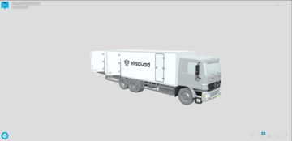
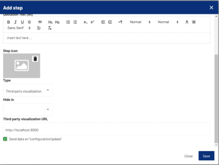

# Integrate Sketchfab viewer with Elfsquad

In this tutorial I will show you a basic integration of the Sketchfab viewer with Elfsquad.

### 1. Embed Sketchfab viewer
Let's start with creating creating a new HTML page that embeds a Sketchfab viewer. This sample code can also be found on the official [Sketchfab for Developers Viewer API page](https://sketchfab.com/developers/viewer).
```html
<!DOCTYPE HTML>
<html>
<head>
    <meta charset="UTF-8">
    <meta name="viewport" content="width=device-width, initial-scale=1">
    <title>Sketchfab Viewer API example</title>

    <!-- Insert the Sketchfab viewer script -->
    <script type="text/javascript" src="https://static.sketchfab.com/api/sketchfab-viewer-1.12.1.js"></script>

    <style>
        html, body{
            margin:0;
            padding:0;
            overflow: hidden;
        }
        iframe {
            border:none;
            height:100vh;
            width:100vw;
        }
    </style>
</head>

<body>
    <!-- Insert an empty iframe with attributes -->
    <iframe src="" id="api-frame" allow="autoplay; fullscreen; xr-spatial-tracking" xr-spatial-tracking execution-while-out-of-viewport execution-while-not-rendered web-share allowfullscreen mozallowfullscreen="true" webkitallowfullscreen="true"></iframe>

    <!-- Initialize the viewer -->
    <script type="text/javascript">
        const iframe = document.getElementById( 'api-frame' );
        const uid = 'cee9dd8f490c47469d2a4e64f99e8056'; // Replace with the ID of your model.
        const client = new Sketchfab( iframe );
        let sketchfabApi;
        client.init( uid, {
            success: function onSuccess( api ){
                sketchfabApi = api;
                api.start();
                api.addEventListener( 'viewerready', function() {

                    console.log( 'Viewer is ready' );

                } );
            },
            error: function onError() {
                console.log( 'Viewer error' );
            }
        } );
    </script>
</body>
</html>
```

Now you should be able to open the HTML file in your browser and see your 3D model:



### 2. Serve through web server
In order to be able to embed the viewer as a third party visualization within Elfsquad, the newly created HTML page needs to be served through a web server. For this tutorial it is sufficient to use localhost.

From within the folder in which you created the HTML file type the following command:
```bash
python -m http.server 8000
```

Now if you navigate to http://localhost:8000, you should see your page being served.

### 3. Embed in Elfsquad
Now that we have a web server running, we can embed the viewer in Elfsquad. 
Within the Elfsquad EMS navigate to the step editor of the model you want to embed the viewer in. 

Create a new step and select the Type "Third party visualization". In the "Third party visualization URL" field enter the URL of your HTML page. In this case, it would be http://localhost:8000.



Now hit save and you should see your 3D model being embedded in Elfsquad.

### 4. Listening to configuration changes
In order to be able to react to configuration changes, we need to add a listener to the viewer. This listener will be activated in the `viewerReady` event callback.

Update the `viewerready` event listener to first retrieve a node map of the model. This node map will be used to identify the parts of the model that need to be shown or hidden. Then we will call the `activateConfigurationUpdateListener` function that will add the listener to the page.
```javascript
let nodeMap = null;
client.init( uid, {
    success: function onSuccess( api ){
        sketchfabApi = api;
        api.start();
        api.addEventListener( 'viewerready', function() {

            api.getNodeMap(function(err, nodes) {
                if (!err) {
                    nodeMap = nodes;
                    activateConfigurationUpdateListener();
                }
            });
        } );
    },
    error: function onError() {
        console.log( 'Viewer error' );
    }
} );
```

Now we can define the `activateConfigurationUpdateListener` function. This function will be called when the viewer is ready and will add a listener to page that will be activated when the configuration changes. The listener will then call the `updateViewer` function with the new configuration as an argument.
```javascript
function activateConfigurationUpdateListener() {
    window.addEventListener('message', function(e){
        if (e.data && e.data.name == 'elfsquad.configurationUpdated'){
            updateViewer(e.data.args);
        }                 
    });
}
```

Now we can define the `updateViewer` function. This function will be called when the configuration changes and will update the viewer with the new configuration.

For this example I will recursively iterate over all the features in the configuration and based on whether the feature is enabled or not, I will either show or hide the corresponding part of the model. This is just an example and you can implement any logic you want here. 
```javascript
function updateViewer(configuration) {
    const stack = configuration.steps.map(step => step.features).flat(1);

    while(stack.length > 0) {
        const current = stack.pop();
        for (let f of current.features) stack.push(f);
        if (!current.code) continue;        
        
        const ids = Object.values(nodeMap)
            .filter(node => node.name == current.code)
            .map(node => node.instanceID);
        
        for (let id of ids) {
            if (current.isSelected) {
                sketchfabApi.show(id);
            } else {
                sketchfabApi.hide(id);
            }
        }
    }
}
```